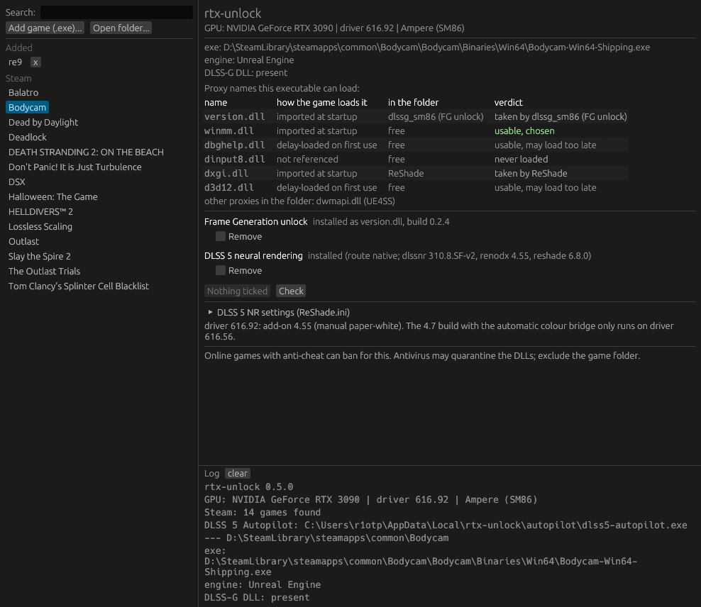

<h1 align="center">rtx-unlock</h1>

<p align="center">DLSS Frame Generation and DLSS 5 neural rendering on RTX 20 and 30 series cards.<br>One executable. Pick a game, press Install.</p>

<p align="center"><a href="https://github.com/ShaggyLorean/rtx-unlock/releases/latest">Download the latest release</a></p>

<p align="center"></p>

## What it does

**Frame Generation unlock.** Games that ship Streamline DLSS-G hide the option on Turing and Ampere. rtx-unlock reads the game's executable, works out which proxy DLL names it loads, places the [dlssg_for_sm86](https://github.com/sdli1995/dlssg_for_sm86) 0.3.5 proxy under the safest free one and writes its ini. The proxy carries its own DLSS-G runtime, so the game's own Frame Generation setting appears and works, up to 6X on the 310.9 build.

**DLSS 5 neural rendering.** rtx-unlock runs [DLSS 5 Autopilot](https://github.com/Kizzuwatnaa/DLSS5-Autopilot) in the background on its native route: ReShade, the renodx-dlss5 add-on and the nvngx_dlssnr build that matches your driver. Autopilot is fetched from GitHub and checked against its SHA-256 sums.

Both are removable. Every file the tool writes is recorded in a manifest next to the game executable, and Remove deletes exactly that list plus the proxy's own log folder.

## Requirements

- Windows 10 or 11, 64-bit, with an NVIDIA driver installed (nvidia-smi must run).
- For the Frame Generation unlock: an RTX 20, RTX 30 or GTX 16 card, and a game that ships `sl.dlss_g.dll` or `nvngx_dlssg.dll`. Without that DLL there is nothing to unlock and the checkbox stays disabled.
- For DLSS 5: a DirectX 12 game with DLSS Super Resolution.

## Use

1. Run `rtx-unlock.exe`. Your Steam library is listed on the left. For anything else, "Add game (.exe)" picks the game's executable and keeps it in the list under "Added"; "Open folder" inspects a folder once without saving it.
2. Select a game. The right side shows the executable, the engine, your GPU and the proxy table: one row per proxy name, how the game loads it, what already sits in the folder under that name, and the verdict. The row marked "chosen" is the one Install will use.
3. Each component shows its state. The checkbox next to it reads Install when it is missing and Remove when it is present. With the FG unlock ticked you can pick the build and the multiplier ceiling. Tick what you want; the button says exactly what will happen, for example "Install 2" or "Install 1, remove 1".
4. Launch the game.
   - Frame Generation: enable "NVIDIA DLSS Frame Generation" in the game's settings. Start with 2X.
   - DLSS 5: press Home to open ReShade, then enable neural rendering on the DLSS 5 tab. On RTX 20 and 30 the model runs in FP16 and costs roughly half your frame rate at full model resolution; lower the model resolution.
5. Check reports what is installed and what the logs say. Removing deletes only the files listed in the tool's manifest, so a hand-made install is left alone and named as such.

A folder or an .exe path on the command line selects that game at startup: `rtx-unlock.exe "D:\Games\Bodycam"` or `rtx-unlock.exe "D:\Games\Ravage\Binaries\Win64\Halloween.exe"`. Added games are stored in `%LOCALAPPDATA%\rtx-unlock\games.json`; removing one from the list touches nothing in the game folder.

## Which proxy name

A proxy DLL only runs if the game asks Windows for a DLL of that name and Windows finds the game's copy first. rtx-unlock checks six names, `version.dll`, `winmm.dll`, `dbghelp.dll`, `dinput8.dll`, `dxgi.dll` and `d3d12.dll`, against three sources of evidence in the executable:

| evidence | meaning |
|---|---|
| imported at startup | listed in the import table; Windows loads the game's copy before any game code runs |
| delay-loaded on first use | listed in the delay-load table; loaded when first called, which can be after DLSS-G has already started |
| only named in the executable | the name appears as a string; the game may or may not LoadLibrary it |

A name is skipped when a file already sits in the folder under it (UE4SS, ReShade, OptiScaler and REFramework are recognised and named) or when Windows lists it as a KnownDLL, where the system copy always wins. The pick order is: a startup import among `version`, `winmm`, `dbghelp`, `dinput8`; then a startup import of `dxgi` or `d3d12`, which sit on the render path and are used only when nothing else is available; then delay-loaded names in the same order. Names that are only referenced are never chosen automatically.

When no name is usable the app says so and lists what it found. Ultimate ASI Loader is the manual way around it: it takes a name of its own and loads `version.dll` renamed to `.asi`.

## Builds

| build | runtime | ceiling | notes |
|---|---|---|---|
| 0.3.5, DLSS-G 310.9 | 310.9.1 | 6X | default; 6X needs a game whose own Streamline plugin allows it, otherwise it stays at 4X |
| 0.3.5, DLSS-G 310.1 | 310.1.0 | 4X | same kernels at 4X and below; pick it if a game misbehaves on 310.9 |
| 0.1.0 legacy | 310.1.0 | 4X | the original build, `version.dll` only |

The ini is written with `Optimized=1`, which keeps the generated image bit-identical to NVIDIA's own runtime. Edit `dlssg_sm86.ini` next to the proxy for the other tiers; the proxy documents every key in its `docs\INSTALL.en.md`.

## Updates

On startup the app compares itself with the latest GitHub release. When a newer one exists, a bar at the top offers Update now. The new executable is checked against the release's SHA256SUMS.txt, swapped in place of the running one, and the app restarts with the same game selected.

## DLSS 5 settings

When DLSS 5 is installed, a settings panel edits the `[RenoDX.DLSS5]` section of ReShade.ini: style, preset, intensity, local tone and structure, skin structure, UI correction and paper-white. Save while the game is closed; ReShade rewrites the ini on exit.

**The frame looks grey or washed out.** The game hands DLSS a scene-linear buffer from before tonemapping (RE Engine and Control do this). renodx-dlss5 4.55 maps that buffer to SDR with a fixed paper-white divisor, and the default of 1.0 blows every pixel out. rtx-unlock sets paper-white to 16 on RE Engine games at install time. Tune it between 8 and 32 to the scene.

**Driver note.** On NVIDIA driver 616.64 and newer, renodx-dlss5 4.6 and 4.7 fault on every frame (0 of 300 evaluates in the DLSS5-Feeder author's measurement), so 4.55 is installed and colour mapping stays manual. The 4.7 build with its automatic colour bridge runs on driver 616.56.

## Read before installing

- Online games with anti-cheat can ban for proxy DLLs and ReShade add-ons. That risk is yours. Easy Anti-Cheat and BattlEye are detected and shown in red.
- Antivirus software flags proxy DLLs and LoadLibrary hooks. Exclude the game folder.
- The FG unlock needs the game's own DLSS-G. A game without a Frame Generation option cannot get one this way.
- RE Engine games (Capcom) usually import one of the six names directly and get a normal proxy. When none is free, rtx-unlock installs the nightly REFramework `dinput8.dll` if it is missing and places the proxy under `reframework\plugins`.
- The OptiScaler route is left out on purpose: it corrupts SceneCapture rendering (scopes, mirrors) and conflicts with the game's own DLSS-G.
- The proxy writes its logs to `dlssg_sm86\logs` next to the executable and caches its runtime under `%LOCALAPPDATA%\DlssgSm86`. Remove deletes the logs; the cache stays.

## Build

```
rustup default stable-x86_64-pc-windows-gnu
cargo build --release
```

The binary is `target\release\rtx-unlock.exe`. `cargo test` runs the unit tests. `RTXU_ANALYZE=<game folder or exe> cargo test analyze_env_dir -- --ignored --nocapture` prints the proxy table for a game. `RTXU_E2E_GAME=<game folder> cargo test e2e -- --ignored --nocapture` runs a real install, remove, install cycle against a game; add `RTXU_E2E_CLEAN=1` to leave the folder clean afterwards.

## Sources

Nothing is bundled. Every component is downloaded at run time from its publisher, pinned to a commit and a SHA-256 where the publisher does not sign releases.

- [sdli1995/dlssg_for_sm86](https://github.com/sdli1995/dlssg_for_sm86): the DLSS-G proxy with the embedded runtime, tag 0.3.5. SM75 route by Coldwood1026.
- [Kizzuwatnaa/DLSS5-Autopilot](https://github.com/Kizzuwatnaa/DLSS5-Autopilot): MIT.
- [praydog/REFramework](https://github.com/praydog/REFramework): nightly monolithic build.
- ReShade by crosire and RenoDX by clshortfuse are downloaded by Autopilot from their publishers.
